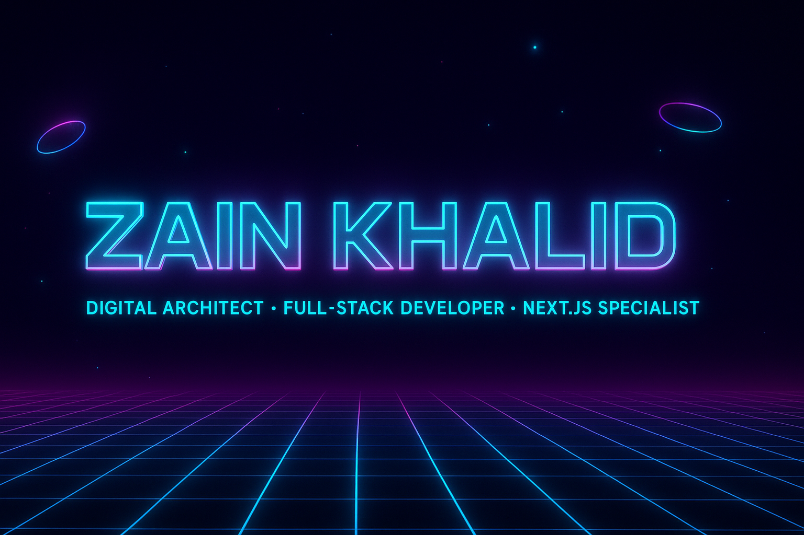

<!-- Cyberpunk Premium GitHub Profile README -->

<!-- Banner -->

  

<!-- Animated Intro -->
<h1 align="center">
  
</h1>

---

<!-- Neon Social Links -->

  
  
  

---

## 👾 About Me  

💡 I’m **Zain Khalid**, a digital architect who builds **immersive, futuristic, and lightning-fast web apps**.  
⚡ My work is guided by minimalism, high-performance coding, and **visual storytelling in 3D and motion**.  
🎨 I merge **aesthetic creativity** with **engineering precision** to craft **next-level experiences**.  

---

## 🛠️ My Cyberpunk Tech Arsenal  

  

---

## 🌌 Featured Projects  

<!-- Project 1 -->
  

<i>A futuristic showcase of my craft in <b>WebGL + Next.js</b></i>

<!-- Project 2 -->
  

<i>An elegant, cyberpunk-inspired <b>E-commerce web app</b></i>

<!-- Project 3 -->
  

<i>Scalable Jewelry <b>E-commerce web app</b></i>

---

## 📊 GitHub Stats  

  
  

---

## 🚀 Let’s Connect  

💌 I’m open for **collaborations, freelance projects, and futuristic ideas**.  
If you’re building something extraordinary, I want in.  

  

---

  
⚡ *"Code is not just logic — it’s digital art in motion."* ⚡  

